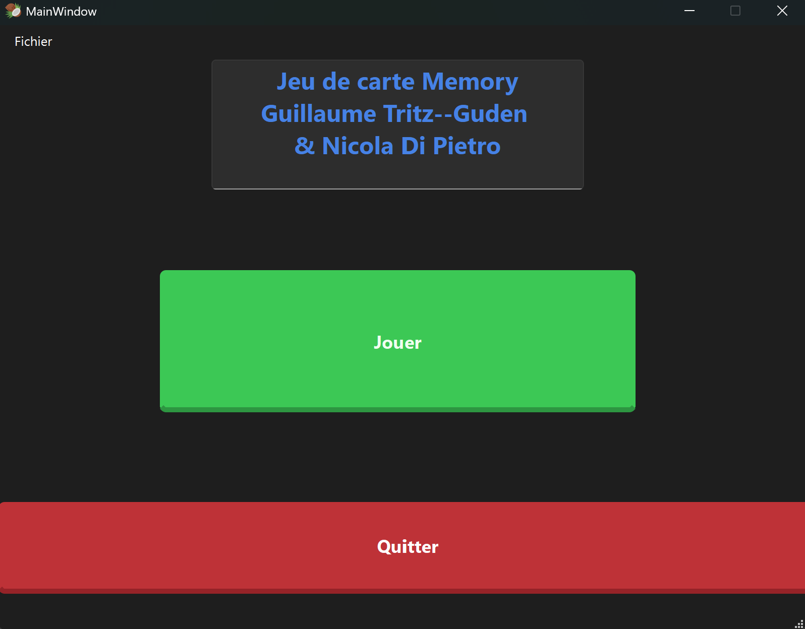
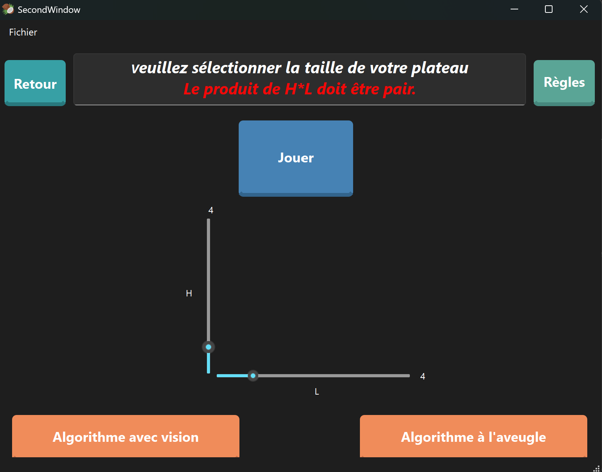

🃏 Memory Card Game

  📖 Project Description
  
  This project is a Memory Card Game where the player must find matching pairs of cards by flipping them two at a time.
  The goal of the game is to match all pairs using memory and concentration in the fewest possible moves.
  
  This project was developed to practice programming fundamentals, game logic, and user interaction.

  🎯 Objectives

  - Implement the core logic of a Memory / Matching Card game

  - Manage game states (flipped cards, matched pairs, score)

  - Improve problem-solving and algorithmic thinking

  - Provide a simple and interactive gameplay experience

  🎮 Gameplay Rules

  - All cards are placed face down at the start of the game.

  - The player flips two cards per turn.

  - If the cards match, they remain face up and the cards become green.

  - If they do not match, the cards become red for 2 seconds, then they are flipped back face down.

 - The game ends when all pairs have been matched.

  ⚙️ Features

  - 🂠 Randomized card positions at each game start

  - ✅ Pair matching detection

  - 🔄 Turn-based gameplay

  - 📊 Move counter / score tracking 

  - 🏁 End-of-game detection

    Screenshot of the first window displayed when the game is launched
  

    Screenshot of the second window, where the player can choose the board size and the algorithm—either to play manually or to use one of the automated algorithms.
    
    The first algorithm attempts to solve the game as quickly as possible without any prior knowledge of the card positions.
    The second algorithm knows the positions of the cards but first tries 100 random card selections before systematically turning cards until all pairs are found.
    

    
   During the game, if the two selected cards form a pair, they remain face up and turn green. If they do not form a pair, they turn red for two seconds before flipping back.

  The game also keeps track of the number of attempts, applying a penalty when the same attempt is repeated two or more times, and counts the total number of pairs found.
  

  👤 Authors

  Name: Nicola Di Pietro & Guillaume Tritz--Guden

  Project type: Academic 
